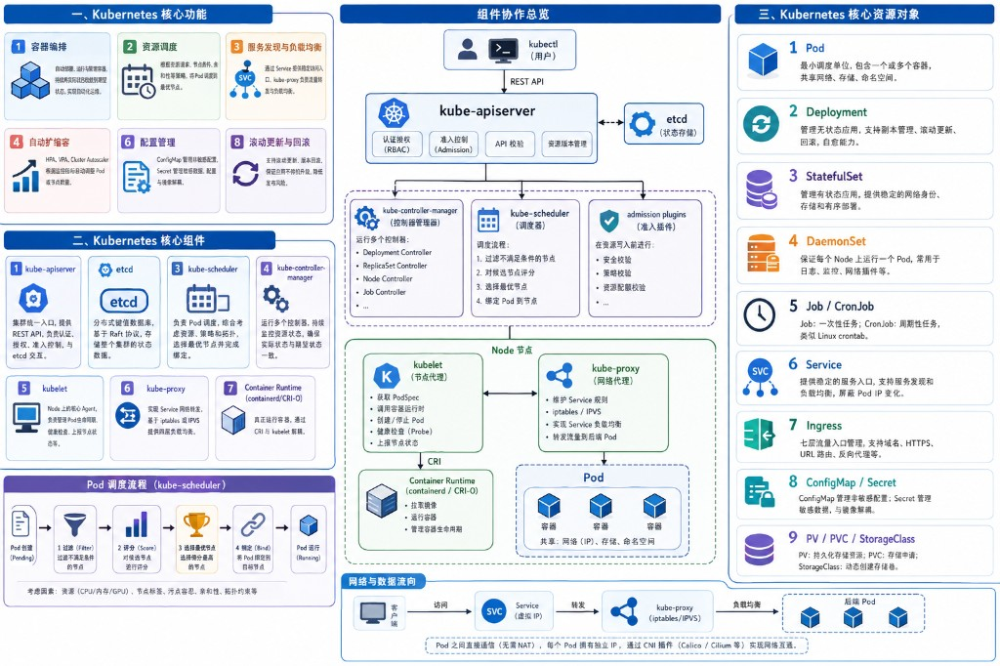

# Kubernetes 基础功能与组件

Kubernetes（K8s）本质上是一个面向容器的分布式资源管理与自动化运维平台，其核心目标是解决大规模容器集群中的部署、调度、扩缩容、服务治理、配置管理以及故障恢复问题。Kubernetes 并不是简单的「容器运行工具」，而是一套完整的声明式控制系统：用户通过 YAML 描述期望状态，系统内部控制循环持续将实际状态收敛到目标状态。

## 总览说明图



> 一图速览：核心功能 · 核心组件 · 资源对象 · 组件协作 · Pod 调度流程 · 网络数据流向

---

## 一、Kubernetes 的核心功能

### 1. 容器编排（Container Orchestration）

Kubernetes 最基础的功能是容器编排，即自动管理大量容器的部署、运行与生命周期。传统情况下，开发者需要手动在服务器上启动容器、处理故障、分配资源，而 Kubernetes 会自动完成这些工作。用户只需要声明「需要运行什么应用、运行几个副本、需要多少资源」，K8s 会自动调度并维持这些容器运行。

其实现机制本质上依赖于**声明式 API + 控制循环**。用户向 kube-apiserver 提交 Deployment 等资源对象后，Deployment Controller 会持续监控实际运行状态，如果发现 Pod 数量不足、容器崩溃或节点失效，就会自动创建新的 Pod 进行恢复，因此 Kubernetes 的容器编排本质上是一种「自动状态修正系统」。

> **对应源码**：`03-control-plane/kube-controller-manager/` → Deployment Controller、ReplicaSet Controller

---

### 2. 资源调度（Scheduling）

Kubernetes 的第二个核心功能是资源调度，即决定「哪个 Pod 应该运行在哪个 Node 上」。在大规模集群中，不同节点拥有不同 CPU、内存、GPU、磁盘以及网络资源，因此必须通过调度器进行资源分配。

其核心组件是 **kube-scheduler**。当一个 Pod 创建后，初始状态为 Pending，此时 Scheduler 会基于资源请求（Requests）、资源限制（Limits）、节点标签（Label）、污点与容忍（Taint/Toleration）、亲和性（Affinity）、拓扑约束等条件进行过滤与评分，然后选择最优节点进行绑定。

调度流程本质上可以概括为：

```
Pod 创建
  → Scheduler 发现未绑定 Pod
  → Filter 过滤不满足条件节点
  → Score 对候选节点评分
  → 选择最优节点
  → Bind 绑定 Node
```

在 AI Infra 场景中，GPU 调度、NUMA 感知调度、Gang Scheduling 等高级能力也是基于 Kubernetes 调度框架扩展实现的。

> **对应源码**：`03-control-plane/kube-scheduler/`、`06-core-mechanisms/scheduling/`

---

### 3. 服务发现与负载均衡（Service Discovery & Load Balancing）

由于 Pod 会频繁重建，IP 地址并不稳定，因此 Kubernetes 引入 **Service** 作为稳定访问入口。Service 本质上是一组 Pod 的逻辑抽象，它通过 Label Selector 自动发现后端 Pod，并提供统一虚拟 IP。

其实现机制依赖 **kube-proxy**。kube-proxy 会在节点上通过 iptables 或 IPVS 规则，将访问 Service 的流量转发到后端 Pod，实现四层负载均衡。

Kubernetes 的网络模型要求：

- 每个 Pod 拥有独立 IP
- Pod 之间无需 NAT 可直接通信

因此 K8s 本身不直接实现网络，而是通过 CNI 插件（如 Calico、Cilium）构建 Pod 网络。

> **对应源码**：`04-node/kube-proxy/`、`06-core-mechanisms/networking/`

---

### 4. 自动扩缩容（Auto Scaling）

Kubernetes 提供自动扩缩容能力，用于根据业务负载动态调整资源。

- **HPA**（Horizontal Pod Autoscaler）会根据 CPU、内存或 Prometheus 指标自动增加或减少 Pod 副本数
- **VPA**（Vertical Pod Autoscaler）用于动态调整 Pod 的资源配额
- **Cluster Autoscaler** 则能够自动扩缩 Node 节点数量

例如：

```
流量增加 → CPU 升高 → HPA 检测指标 → 自动扩容 Pod
```

其本质是控制器周期性获取监控指标，然后动态修改 Deployment 副本数。

> **对应源码**：`pkg/controller/podautoscaler/`（HPA Controller）

---

### 5. 自愈（Self-Healing）

Kubernetes 的重要能力之一是自愈。当 Pod 崩溃、容器异常退出或 Node 宕机时，系统能够自动恢复服务。

其实现依赖多个 Controller 与 kubelet 协同完成：

- **kubelet** 会周期性执行 Liveness Probe 与 Readiness Probe 检查
- 如果 Pod 异常，**ReplicaSet Controller** 会自动重新创建 Pod
- 如果节点失联，**Node Controller** 会将节点标记为 NotReady，并触发 Pod 迁移

因此 Kubernetes 的核心思想并不是「修复容器」，而是：

```
销毁异常实例 → 重新创建新实例
```

这也是云原生「不可变基础设施」的核心理念。

> **对应源码**：`04-node/kubelet/`（Probe）、`03-control-plane/kube-controller-manager/`（Node/ReplicaSet Controller）

---

### 6. 配置管理（Configuration Management）

Kubernetes 提供统一配置管理能力，用于将配置与镜像解耦。

- **ConfigMap** 用于存储非敏感配置，例如配置文件、启动参数与环境变量
- **Secret** 用于保存密码、Token、证书等敏感数据

Pod 在启动时可以通过环境变量、Volume 挂载等方式读取配置。这样应用无需重新构建镜像即可修改配置，实现配置热更新与环境隔离。

> **对应源码**：`pkg/kubelet/config/`、`pkg/volume/configmap/`、`pkg/volume/secret/`

---

### 7. 存储编排（Storage Orchestration）

Kubernetes 不仅管理计算资源，也管理存储资源。

由于容器本身是临时性的，因此 K8s 提供 **PersistentVolume（PV）** 与 **PersistentVolumeClaim（PVC）** 实现持久化存储抽象。用户通过 PVC 声明存储需求，而底层存储系统（Ceph、NFS、云磁盘等）通过 **StorageClass** 动态提供存储卷。

其核心思想是：

```
存储资源抽象化 → 应用与底层存储解耦
```

> **对应源码**：`06-core-mechanisms/volume/`、`pkg/controller/volume/`

---

### 8. 滚动更新与版本回滚（Rolling Update & Rollback）

Kubernetes 支持应用不停机升级。

Deployment Controller 会逐步创建新版本 Pod，并逐步删除旧版本 Pod，从而实现 Rolling Update。如果升级失败，还可以通过 Revision 回滚到旧版本。

其实现依赖 ReplicaSet：每次 Deployment 更新都会创建新的 ReplicaSet，再通过副本迁移逐步完成版本切换。

> **对应源码**：`pkg/controller/deployment/`、`pkg/controller/replicaset/`

---

## 二、Kubernetes 核心组件

### 1. kube-apiserver

kube-apiserver 是 Kubernetes 控制面的核心入口，也是整个系统**唯一的统一通信中心**。所有组件（Scheduler、Controller、kubectl、kubelet）都必须通过 API Server 进行通信。

其主要功能包括：

- 提供 REST API
- 对资源对象进行校验
- 认证与权限控制（RBAC）
- 准入控制（Admission）
- 资源版本管理
- 与 etcd 交互

因此 Kubernetes 本质上是：**一个 API 驱动系统**。

> **对应源码**：`03-control-plane/kube-apiserver/`、`02-foundation/apiserver-framework/`

---

### 2. etcd

etcd 是 Kubernetes 的分布式 KV 数据库，用于存储整个集群的状态数据，包括：

- Pod 信息
- Deployment 信息
- Service 信息
- Secret
- Node 状态

其底层基于 Raft 协议实现强一致性，因此 etcd 可以理解为：**Kubernetes 的「状态数据库」**。

> **对应源码**：`staging/src/k8s.io/apiserver/pkg/storage/etcd3/`

---

### 3. kube-scheduler

kube-scheduler 负责 Pod 调度，即决定 Pod 运行在哪个 Node 上。它会综合考虑：

- CPU / 内存 / GPU
- 污点容忍
- 节点亲和性
- 拓扑约束

调度器本质上是：**资源分配决策中心**。

> **对应源码**：`03-control-plane/kube-scheduler/`

---

### 4. kube-controller-manager

Controller Manager 内部运行大量 Controller，用于持续监控资源状态，例如：

- Deployment Controller
- ReplicaSet Controller
- Node Controller
- Job Controller

Controller 会不断比较：**实际状态 vs 期望状态**，如果发现不一致，就自动修复。

> **对应源码**：`03-control-plane/kube-controller-manager/`、`06-core-mechanisms/controllers/`

---

### 5. kubelet

kubelet 是运行在 Node 上的核心 Agent，负责：

- 获取 PodSpec
- 调用容器运行时
- 创建 Pod
- 健康检查
- 上报 Node 状态

kubelet 可以理解为：**Node 的执行器**。

> **对应源码**：`04-node/kubelet/`

---

### 6. kube-proxy

kube-proxy 用于实现 Service 网络，核心功能包括：

- Service 转发
- 四层负载均衡
- 网络规则维护

底层依赖 iptables 或 IPVS 实现流量转发。

> **对应源码**：`04-node/kube-proxy/`

---

### 7. Container Runtime

Container Runtime 负责真正运行容器，常见实现包括 containerd、CRI-O。Kubernetes 通过 **CRI**（Container Runtime Interface）与运行时解耦。

> **对应源码**：`04-node/cri/`、`staging/src/k8s.io/cri-api/`

---

## 三、Kubernetes 核心资源对象

### 1. Pod

Pod 是 Kubernetes **最小调度单位**。一个 Pod 内多个容器共享网络、IP、存储，因此 Pod 本质上是：**容器运行环境抽象**。

> **对应源码**：`02-foundation/api-types/` → `api/core/v1/types.go`

---

### 2. Deployment

Deployment 用于管理**无状态应用**，主要能力包括：

- 副本管理
- 滚动更新
- 回滚
- 自愈

Deployment 内部通过 ReplicaSet 维护 Pod 副本。

> **对应源码**：`pkg/controller/deployment/`、`api/apps/v1/types.go`

---

### 3. StatefulSet

StatefulSet 用于管理**有状态服务**，特点包括：

- 固定 Pod 名称
- 固定存储卷
- 固定网络身份
- 有序启动

适用于 MySQL、Redis、Kafka 等场景。

> **对应源码**：`pkg/controller/statefulset/`、`api/apps/v1/types.go`

---

### 4. DaemonSet

DaemonSet 保证**每个 Node 运行一个 Pod**，典型用途包括日志采集、监控 Agent、网络插件，例如 Fluentd、Prometheus Node Exporter。

> **对应源码**：`pkg/controller/daemon/`、`api/apps/v1/types.go`

---

### 5. Job 与 CronJob

- **Job** 用于一次性任务，例如数据迁移与离线计算
- **CronJob** 用于周期性任务，本质上类似 Linux crontab

> **对应源码**：`pkg/controller/job/`、`pkg/controller/cronjob/`

---

### 6. Service

Service 用于提供稳定服务入口，核心作用包括：

- 服务发现
- 负载均衡
- 屏蔽 Pod IP 变化

> **对应源码**：`pkg/controller/service/`、`pkg/proxy/`、`api/core/v1/types.go`

---

### 7. Ingress

Ingress 用于 HTTP/HTTPS **七层流量入口**管理，功能包括域名路由、HTTPS、URL 转发、反向代理。通常需要配合 Ingress Controller，例如 NGINX Ingress Controller、Traefik。

> **对应源码**：Ingress 本身在 `api/networking/v1/`，Controller 多为外部项目

---

### 8. ConfigMap 与 Secret

- **ConfigMap** 用于非敏感配置
- **Secret** 用于敏感数据管理

它们本质上是：**配置中心抽象**。

> **对应源码**：`pkg/registry/core/configmap/`、`pkg/registry/core/secret/`

---

### 9. PV / PVC / StorageClass

- **PV** 表示底层实际存储资源
- **PVC** 表示用户存储申请
- **StorageClass** 用于动态创建存储卷

三者共同构成 Kubernetes 的存储抽象体系。

> **对应源码**：`pkg/controller/volume/persistentvolume/`、`pkg/controller/volume/pvcprotection/`

---

## 原理与架构图

- **总览说明图**：[k8s-basics-overview.png](../diagrams/k8s-basics-overview.png) — 核心功能、组件、资源对象、协作、调度、网络一图速览
- **详细 Mermaid 图**：[diagrams/k8s-basics-architecture.md](../diagrams/k8s-basics-architecture.md) — 含 13 张可交互渲染的架构/时序/流程图
- **面试问答**：[k8s-basics-interview-qa.md](./k8s-basics-interview-qa.md) — 基础高频 6 题 + 追问与自测

---

## 组件协作总览

```
                    ┌─────────────┐
                    │   kubectl   │
                    └──────┬──────┘
                           │ REST API
                    ┌──────▼──────┐
                    │kube-apiserver│◄──── etcd（状态存储）
                    └──────┬──────┘
              ┌────────────┼────────────┐
              │            │            │
     ┌────────▼───┐ ┌─────▼─────┐ ┌───▼────────┐
     │ controller │ │ scheduler │ │  admission │
     │  manager   │ │           │ │   plugins  │
     └────────────┘ └───────────┘ └────────────┘
              │
              │ 期望状态
     ┌────────▼──────────────────────────┐
     │              Node                  │
     │  ┌─────────┐  ┌─────────┐         │
     │  │ kubelet │  │kube-proxy│         │
     │  └────┬────┘  └─────────┘         │
     │       │ CRI                        │
     │  ┌────▼────┐                        │
     │  │containerd│                       │
     │  └─────────┘                        │
     └─────────────────────────────────────┘
```
