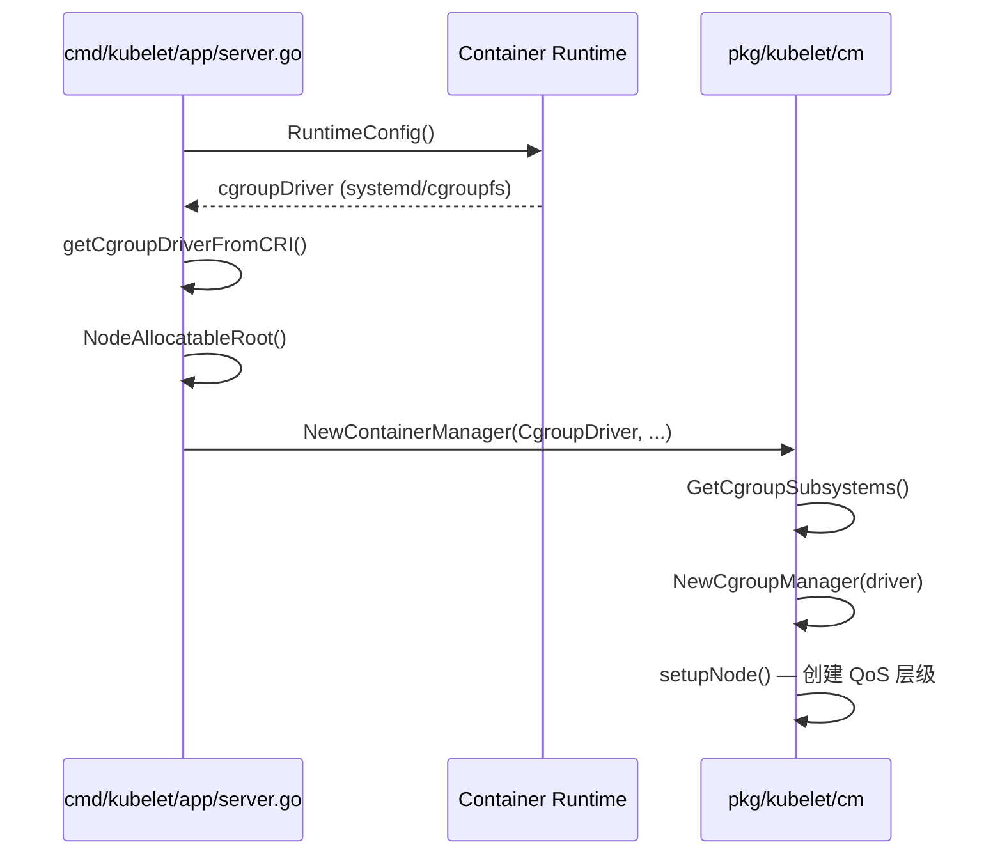

# cgroup 核心源码笔记

> **放置位置**：`04-node/kubelet/cgroup.md`  
> **原因**：cgroup 的创建、QoS 层级、资源限制均由 kubelet 的 **Container Manager（cm）** 负责，属于节点侧执行逻辑，而非控制面组件。  
> **关联**：[集群搭建中的 cgroup 配置](../../05-cli-bootstrap/k8s-cluster-setup-guide.md#42-修改-cgroup-驱动为-systemd)

---

## 一、cgroup 在 K8s 里做什么？

cgroup（Control Group）是 Linux 内核的资源隔离机制。Kubernetes 通过 kubelet 使用 cgroup 实现：

| 能力 | 说明 |
|------|------|
| **资源限制** | Pod/容器的 CPU、内存 requests/limits |
| **QoS 分级** | Guaranteed / Burstable / BestEffort 对应不同 cgroup 层级 |
| **节点可分配** | 从节点总资源中扣除 system/kube reserved |
| **驱逐依据** | kubelet eviction 读取 cgroup 指标判断内存/磁盘压力 |

**关键约束**：kubelet 的 cgroup driver（`systemd` / `cgroupfs`）必须与容器运行时（containerd/Docker）一致，否则 cgroup 路径冲突，集群无法正常工作。

---

## 二、源码目录地图

```
kubernetes-master/
├── pkg/kubelet/cm/                    ★ 核心：Container Manager
│   ├── cgroup_manager_linux.go        cgroup 管理器工厂 + 通用 CRUD
│   ├── cgroup_v1_manager_linux.go     cgroup v1 实现
│   ├── cgroup_v2_manager_linux.go     cgroup v2 实现
│   ├── helpers_linux.go               路径计算、资源换算、子系统探测
│   ├── container_manager_linux.go     容器管理器总入口
│   ├── pod_container_manager_linux.go Pod 级 cgroup 创建
│   ├── util/cgroups_linux.go          底层路径 / PID 读取
│   └── qos/                           QoS 判定辅助
│
├── cmd/kubelet/app/
│   ├── options/options.go             --cgroup-driver 等 CLI 参数
│   └── server.go                      启动时从 CRI 同步 driver
│
├── cmd/kubeadm/app/componentconfigs/
│   └── kubelet.go                     init 时默认 cgroupDriver=systemd
│
├── staging/src/k8s.io/
│   ├── kubelet/config/v1beta1/types.go   KubeletConfiguration.cgroupDriver
│   └── cri-api/.../api.proto              CRI RuntimeConfig 返回 driver
│
└── vendor/github.com/opencontainers/cgroups/   底层 cgroup 操作库
```

---

## 三、核心类型与接口

### 3.1 CgroupManager

**文件**：`pkg/kubelet/cm/cgroup_manager_linux.go`

```go
// 根据 cgroup 版本选择 v1 / v2 管理器
func NewCgroupManager(logger klog.Logger, cs *CgroupSubsystems, cgroupDriver string) CgroupManager

// cgroupDriver == "systemd" 时使用 .slice 命名；否则用 cgroupfs 路径
func newCgroupCommon(..., cgroupDriver string) cgroupCommon {
    return cgroupCommon{
        useSystemd: cgroupDriver == "systemd",
    }
}
```

主要方法：`Create` / `Update` / `Destroy` / `SetCgroupConfig` / `Pids`

### 3.2 CgroupName — 两种命名风格

| Driver | 命名示例 | 转换函数 |
|--------|----------|----------|
| **systemd** | `kubepods.slice/kubepods-burstable.slice/pod-xxx.slice` | `ToSystemd()` |
| **cgroupfs** | `/kubepods/burstable/pod/xxx` | `ToCgroupfs()` |

### 3.3 ContainerManager

**文件**：`pkg/kubelet/cm/container_manager_linux.go`

```go
func NewContainerManager(ctx context.Context, ..., nodeConfig NodeConfig, ...) (ContainerManager, error) {
    subsystems, err := GetCgroupSubsystems()           // 探测 v1/v2 子系统
    cgroupManager := NewCgroupManager(..., nodeConfig.CgroupDriver)
    // ...
}
```

启动时若 `cgroupsPerQOS=true`，会校验 cgroup-root 存在并创建 QoS 层级。

### 3.4 PodContainerManager

**文件**：`pkg/kubelet/cm/pod_container_manager_linux.go`

```go
// Pod 同步时确保 Pod 级 cgroup 存在
func (m *podContainerManagerImpl) EnsureExists(logger klog.Logger, pod *v1.Pod) error
```

Pod cgroup 命名：`pod` + Pod UID，挂在对应 QoS 层级之下。

---

## 四、启动链路（从 kubelet 到 cm）



### 4.1 从 CRI 获取 cgroup driver

**文件**：`cmd/kubelet/app/server.go` → `getCgroupDriverFromCRI()`

```go
switch d := linuxConfig.GetCgroupDriver(); d {
case runtimeapi.CgroupDriver_SYSTEMD:
    s.CgroupDriver = "systemd"
case runtimeapi.CgroupDriver_CGROUPFS:
    s.CgroupDriver = "cgroupfs"
}
```

> 较新 CRI 通过 `RuntimeConfig` 返回 driver；旧实现则回退到 kubelet 配置文件中的值。

### 4.2 kubeadm 默认配置

**文件**：`cmd/kubeadm/app/componentconfigs/kubelet.go`

```go
if len(kc.config.CgroupDriver) == 0 {
    kc.config.CgroupDriver = constants.CgroupDriverSystemd  // 默认 systemd
}
```

这与集群搭建文档中 Docker `native.cgroupdriver=systemd` 的要求一致。

---

## 五、QoS 与 cgroup 层级

当 `--cgroups-per-qos=true`（默认开启）时，节点上形成如下层级：

```
cgroup-root（默认 / 或 kubelet 配置）
└── kubepods/                          ← node allocatable 根
    ├── burstable/                     ← Burstable QoS Pod
    │   └── pod<uid>/
    ├── besteffort/                    ← BestEffort QoS Pod
    │   └── pod<uid>/
    └── <guaranteed pods 直接在 kubepods 下>
        └── pod<uid>/
```

**Guaranteed** Pod：requests == limits 且均设置 CPU/内存  
**Burstable** Pod：有 requests 但不满足 Guaranteed 条件  
**BestEffort** Pod：未设置 requests/limits

**路径计算**：`helpers_linux.go` → `NodeAllocatableRoot()`

```go
func NodeAllocatableRoot(cgroupRoot string, cgroupsPerQOS bool, cgroupDriver string) string {
    // cgroupsPerQOS 时追加 kubepods 层级
    // systemd 驱动转为 .slice 路径
}
```

**资源换算**：`ResourceConfigForPod()` 将 Pod 的 requests/limits 转为 cgroup 的 `cpu.shares` / `cpu.quota` / `memory.limit_in_bytes`（v1）或 `cpu.max` / `memory.max`（v2）。

---

## 六、cgroup v1 vs v2

| 项目 | v1 | v2 |
|------|----|----|
| 实现文件 | `cgroup_v1_manager_linux.go` | `cgroup_v2_manager_linux.go` |
| 探测 | `getCgroupSubsystemsV1()` | `getCgroupSubsystemsV2()` |
| CPU 限制 | `cpu.cfs_quota_us` / `cpu.shares` | `cpu.max` / `cpu.weight` |
| 内存限制 | `memory.limit_in_bytes` | `memory.max` |
| 统一挂载 | 各子系统分开挂载 | 统一挂载在 `/sys/fs/cgroup` |

kubelet 通过 `libcontainercgroups.IsCgroup2UnifiedMode()` 自动判断，无需手动指定。

---

## 七、重要 kubelet 参数

**文件**：`cmd/kubelet/app/options/options.go`

| 参数 | 默认值/说明 |
|------|-------------|
| `--cgroup-driver` | `systemd` 或 `cgroupfs` |
| `--cgroup-root` | Pod cgroup 根路径，默认由 runtime 决定 |
| `--cgroups-per-qos` | `true`，启用 QoS 层级 |
| `--kubelet-cgroups` | kubelet 进程自身所在 cgroup |
| `--runtime-cgroups` | 容器运行时所在 cgroup |
| `--system-cgroups` | 非 K8s 系统进程 cgroup |
| `--enforce-node-allocatable` | 对 pods/system-reserved 等强制 cgroup 限制 |

---

## 八、与 Pod 生命周期的衔接

```
syncLoop 处理 Pod
  → podWorkers
  → kubeGenericRuntimeManager.SyncPod()
  → containerManager.GetPodContainerManager().EnsureExists(pod)   // 创建 Pod cgroup
  → CRI RunPodSandbox / CreateContainer                            // 容器进 cgroup
  → cgroupManager.SetCgroupConfig()                               // 设置 CPU/内存限制
```

容器运行时（containerd）负责把进程写入 cgroup；kubelet cm 负责 **Pod 级 cgroup 层级** 和 **QoS 资源配额**。

---

## 九、依赖库

| 库 | 路径 | 作用 |
|----|------|------|
| opencontainers/cgroups | `vendor/github.com/opencontainers/cgroups/` | Create/Update/Destroy cgroup |
| cgroups/systemd | `.../cgroups/systemd/` | systemd slice 驱动 |
| google/cadvisor | `vendor/github.com/google/cadvisor/` | 从 cgroup 读资源用量 |

---

## 十、建议阅读顺序

| 顺序 | 文件 | 关注点 |
|------|------|--------|
| 1 | `cmd/kubelet/app/options/options.go` | 有哪些 cgroup 相关参数 |
| 2 | `cmd/kubelet/app/server.go` | `getCgroupDriverFromCRI`、传给 cm 的 NodeConfig |
| 3 | `pkg/kubelet/cm/doc.go` | cm 包职责 |
| 4 | `pkg/kubelet/cm/cgroup_manager_linux.go` | driver 选择、Create/Update |
| 5 | `pkg/kubelet/cm/helpers_linux.go` | 路径、资源换算 |
| 6 | `pkg/kubelet/cm/container_manager_linux.go` | `NewContainerManager`、`setupNode` |
| 7 | `pkg/kubelet/cm/pod_container_manager_linux.go` | Pod cgroup 创建 |
| 8 | `cmd/kubeadm/app/componentconfigs/kubelet.go` | 集群初始化时的默认 driver |

---

## 十一、面试 / 实践要点

1. **为什么 Docker 要设 `cgroupdriver=systemd`？**  
   kubeadm 默认 kubelet 用 systemd；Docker 若用 cgroupfs，driver 不一致会导致 kubelet 失败。

2. **cgroup 在 K8s 哪一层实现？**  
   kubelet 的 `pkg/kubelet/cm`，不是 APIServer / Scheduler。

3. **Guaranteed Pod 的 cgroup 路径有何不同？**  
   直接在 `kubepods` 下，不经过 `burstable` / `besteffort` 中间层。

4. **如何验证节点 cgroup 状态？**
   ```bash
   cat /sys/fs/cgroup/cgroup.controllers    # v2
   systemd-cgls | grep kubepods             # systemd 驱动
   ```

---

## 十二、待深入

- [ ] `setupNode()` 创建 QoS 容器的完整流程
- [ ] `enforce-node-allocatable` 如何限制 Pod 可用资源
- [ ] Memory QoS（`memory.min` / `memory.high`）与 cgroup v2
- [ ] CPU Manager 静态策略与 exclusive CPU 的 cgroup 配合

## 个人笔记

（在此记录阅读源码时的理解与疑问）
