# Kubernetes 基础功能与组件 — 原理与架构图

> 对应笔记：[k8s-basics-features-and-components.md](../01-architecture-overview/k8s-basics-features-and-components.md)

---

## 1. 整体架构图

Kubernetes 采用**控制面（Control Plane）+ 工作节点（Worker Node）** 的分层架构，所有组件通过 kube-apiserver 统一通信。

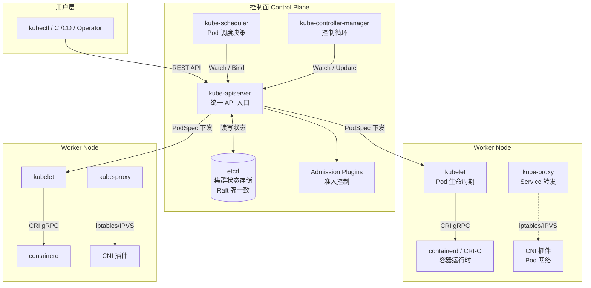

---

## 2. 声明式 API 与控制循环原理

Kubernetes 的核心设计：**用户声明期望状态，Controller 持续收敛实际状态**。

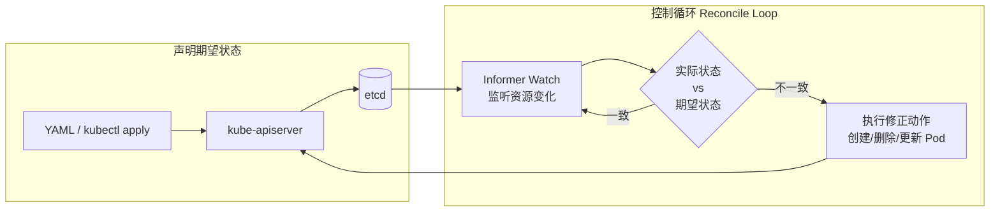

**典型示例 — Deployment 维持副本数：**

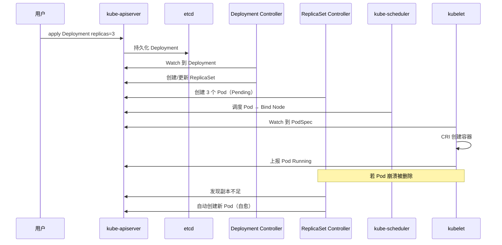

---

## 3. 资源调度原理

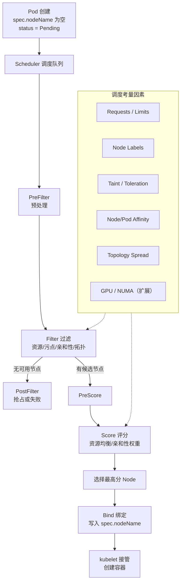

---

## 4. 服务发现与负载均衡

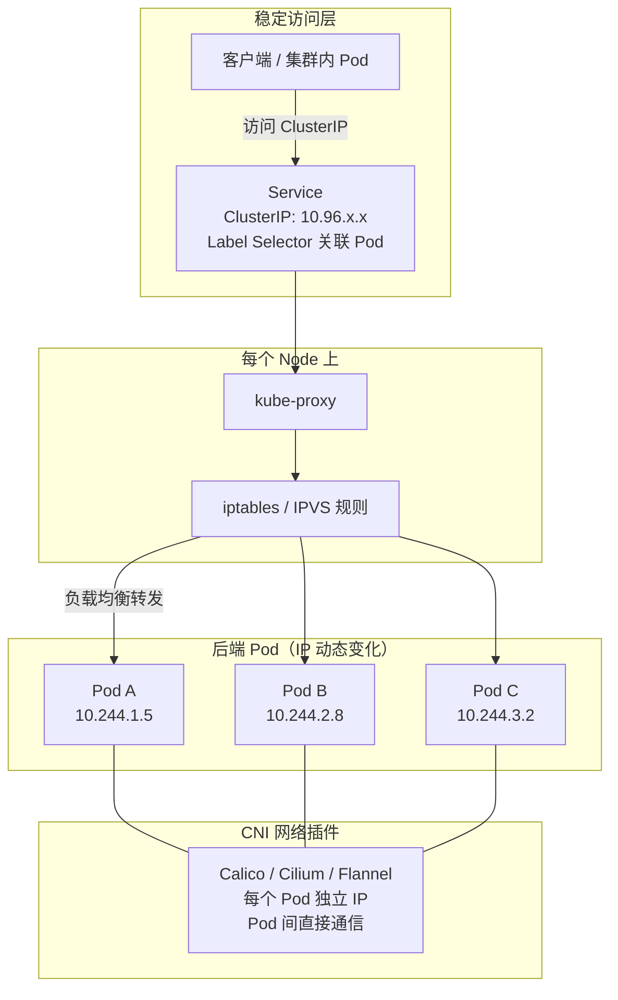

**Service 类型对比：**

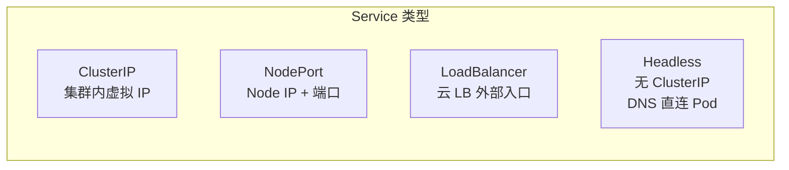

---

## 5. 自动扩缩容原理

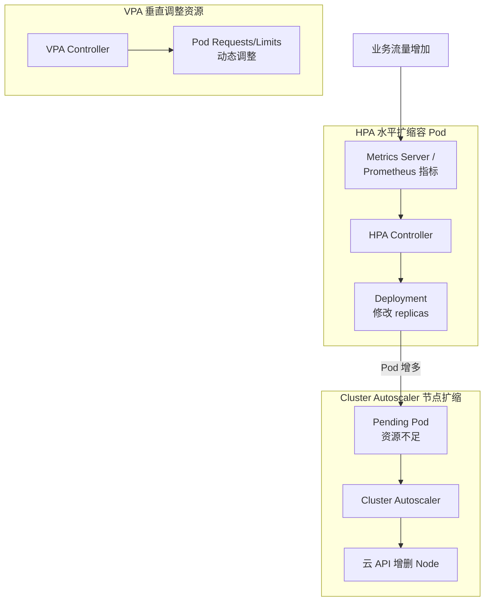

---

## 6. 自愈机制原理

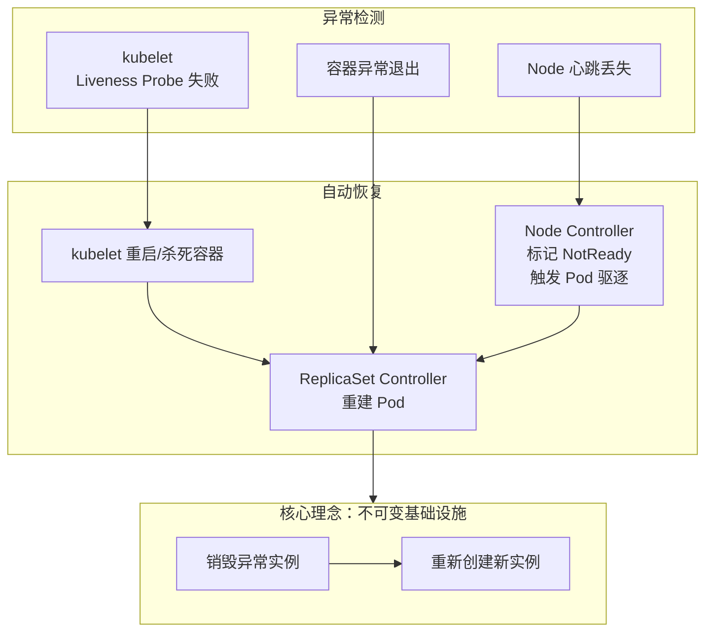

---

## 7. 配置管理原理

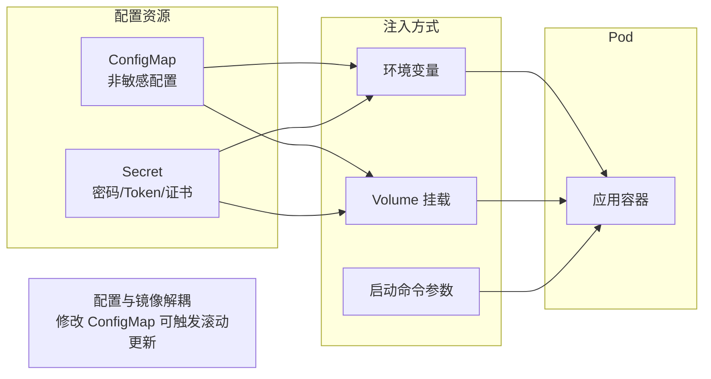

---

## 8. 存储编排原理

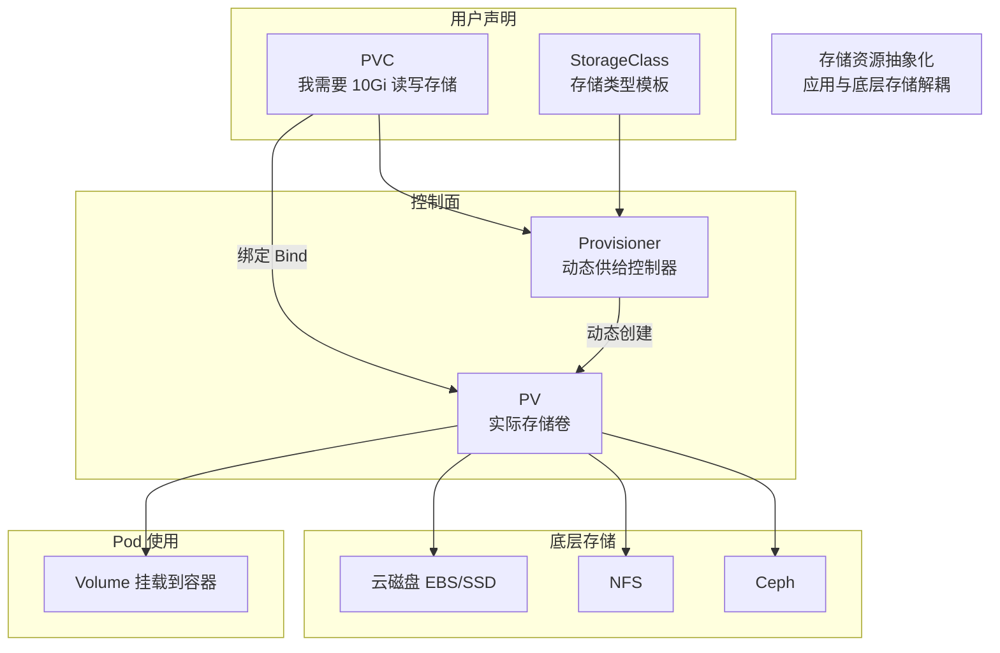

---

## 9. 滚动更新与回滚原理

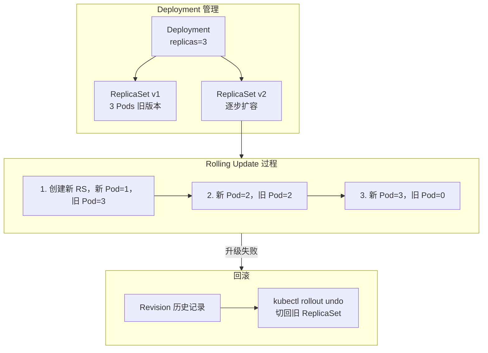

**滚动更新时序：**

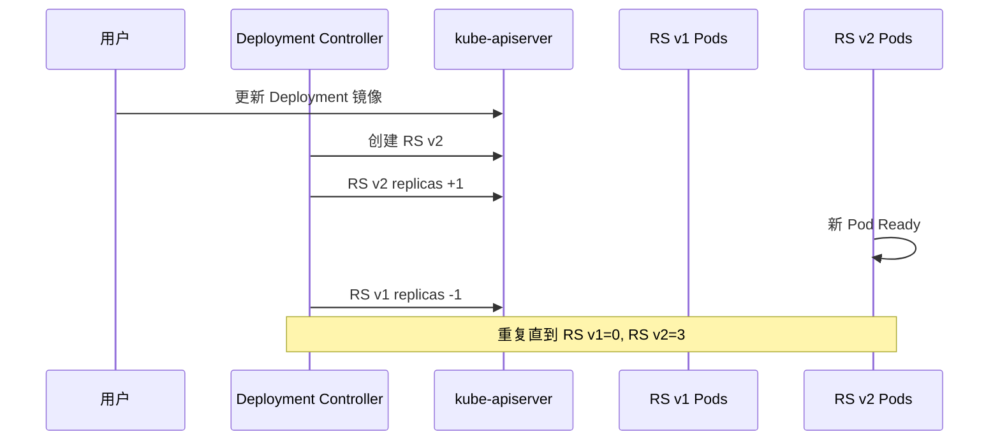

---

## 10. kube-apiserver 请求处理链路

所有组件必须通过 APIServer 通信，一次写请求经过完整的认证授权与准入链路。

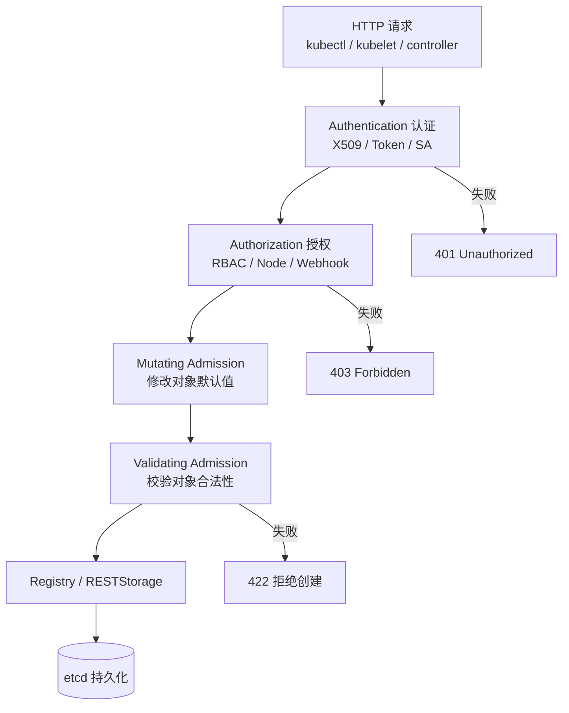

---

## 11. 核心资源对象关系图

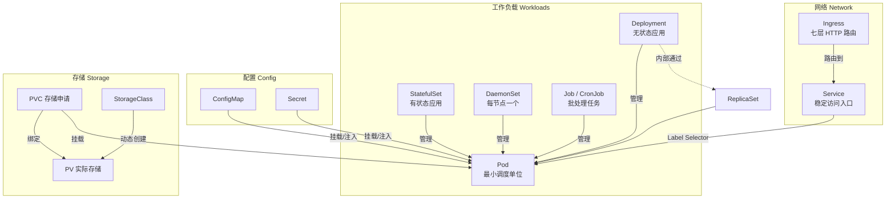

**资源对象分类速查：**

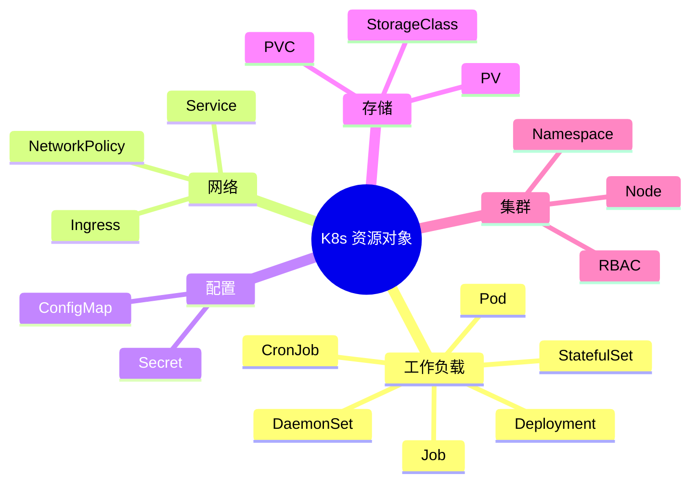

---

## 12. Node 内部组件协作

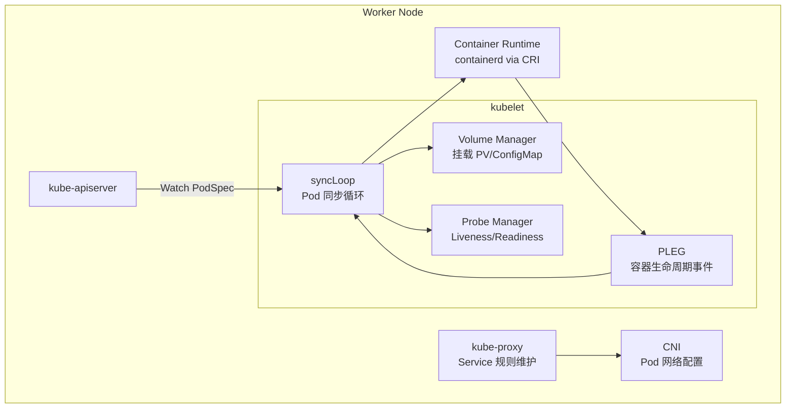

---

## 13. Pod 创建全链路（综合）

将调度、配置、存储、网络串联的完整流程：

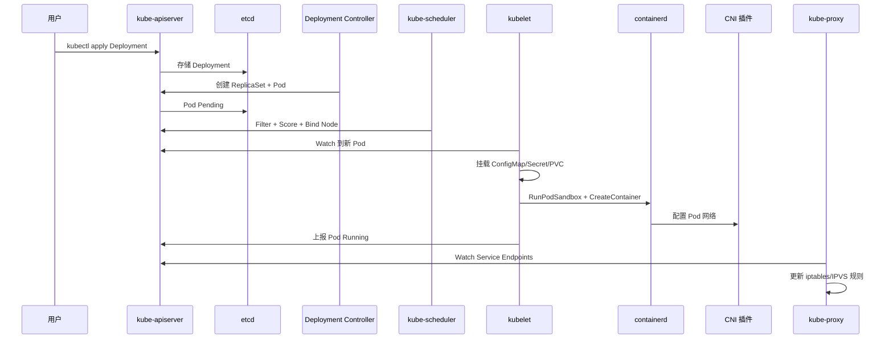

---

## 图例说明

| 符号 | 含义 |
|------|------|
| 实线箭头 | 直接调用 / 数据流 |
| 虚线箭头 | 间接依赖 / 辅助关系 |
| 圆柱体 | 持久化存储（etcd、PV） |
| subgraph | 逻辑分组 |

## 相关源码入口

| 图 | 主要源码路径 |
|----|-------------|
| 控制循环 | `pkg/controller/deployment/` |
| 调度 | `pkg/scheduler/scheduler.go` |
| Service 网络 | `pkg/proxy/` |
| HPA | `pkg/controller/podautoscaler/` |
| 存储 | `pkg/controller/volume/persistentvolume/` |
| APIServer 链路 | `staging/src/k8s.io/apiserver/pkg/endpoints/` |
